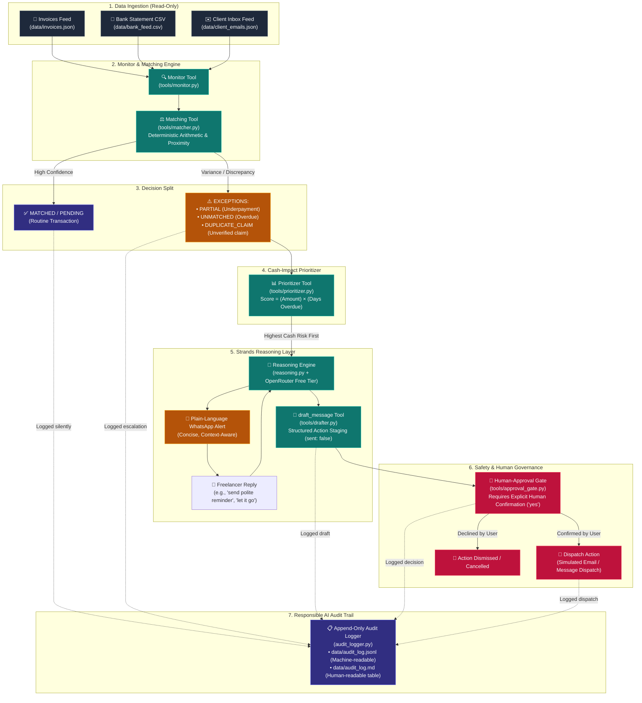

# CashGuard.AI 🛡️
### Invoice Exception & Cash-Flow Guardian for Solo Freelancers

> **Built for the AWS "Agents for Humans" Hackathon — Professional Agents Track**  
> *Autonomous, human-gated cash-flow protection powered by the Strands Agents SDK and OpenRouter.*

[](LICENSE)
[](https://www.python.org/)
[](https://github.com/awslabs/strands-agents)
[-purple.svg)](https://openrouter.ai/)
[](#-responsible-ai-by-design)

---

## 💡 What is CashGuard.AI?

Freelancers, contractors, and solo creative professionals lose an average of **4 to 6 hours every month** performing manual financial triage:
1. **Issued Invoices**: What clients currently owe and when payments are due.
2. **Bank Feeds**: What deposits have actually arrived in the bank account.
3. **Client Inboxes & Messages**: Payment promises, dispute threads, remittance slips, and delayed milestone notices.

When an invoice is paid short by $25 (due to wire or bank fees), paid late, or delayed because of an email promise ("accounting sent it yesterday") that never materialized, solo professionals rarely catch it before their working capital takes a hit. Worse, chasing clients feels adversarial, awkward, and emotionally taxing.

**CashGuard.AI** is an autonomous cash-flow guardian that:
- **Silently reconciles** routine matches in the background (zero notification fatigue).
- **Detects critical discrepancies**: partial underpayments, overdue debts, unverified claims, and accidental duplicate refund claims.
- **Prioritizes cash impact**: ranks issues by `(amount at risk) × (days overdue)` so the highest-stakes emergencies are handled first.
- **Interacts naturally via WhatsApp**: summarizes the situation in plain conversational language and listens to instructions.
- **Drafts follow-up actions safely**: creates tailored client emails or reminder notes, but **never sends anything** without explicit human sign-off.
- **Maintains an immutable audit log**: tracks every silent check, escalation, and human approval for complete transparency.

---

## 🏗️ Architecture & System Design

CashGuard.AI separates deterministic business logic from probabilistic LLM reasoning. Routine arithmetic (amounts, dates, token matching) runs in fast, zero-cost deterministic code, while LLM intelligence is reserved for natural-language alert synthesis, intent parsing, and tone-tailored correspondence.

### Architecture Diagram
> *The standalone Mermaid specification is saved at [`architecture-diagram.mermaid`](architecture-diagram.mermaid).*



---

## 🛡️ Responsible AI by Design

CashGuard.AI was built from the ground up for high-stakes financial operations where hallucination or accidental dispatch can harm client relationships. The system strictly implements three safety pillars:

### 1. Read-Only Data Access
- **Zero Ledger Mutation**: CashGuard.AI operates strictly in read-only mode across invoices, bank feeds, and email inboxes.
- **No Direct Financial Control**: The agent cannot initiate bank transfers, modify invoice totals, or alter accounting records. All financial calculations remain non-destructive.

### 2. Human-Approval Gate (Strict Human-in-the-Loop)
- **Drafts Are Staged, Never Sent**: The `draft_message` tool generates structured proposal objects with `sent: false`. Outbound messages remain completely inert until approved.
- **Explicit Human Confirmation Required**: The `human_approval_gate` tool pauses execution and demands an unambiguous user response (e.g. `yes`, `confirm`, `approve`) before any outbound email or WhatsApp message is marked sent.
- **Zero Accidental Sends**: If the user declines, asks to edit, or dismisses an alert, the draft is cancelled immediately and recorded in the audit trail.

### 3. Comprehensive Append-Only Audit Trail
- **100% Traceability & Explainability**: Every evaluation made by CashGuard.AI—including silent resolutions, variance escalations, draft creations, and approval confirmations—is permanently recorded.
- **Dual Formats**:
  - **Machine-Readable**: [`data/audit_log.jsonl`](data/audit_log.jsonl) containing ISO timestamps, UUIDs, event categories, invoice IDs, and raw parameters.
  - **Human-Readable**: [`data/audit_log.md`](data/audit_log.md) formatted as an executive markdown table highlighting ethical considerations (*Noise Reduction*, *Cash Flow Protection*, *Harm Prevention*, *Human Oversight*).
- **Silent Match Verification**: Judges and auditors can inspect every routine match that was resolved without notifying the user, ensuring the agent did not overlook discrepancies.

---

## 🌐 OpenRouter Integration (Free-Tier Powered)

CashGuard.AI uses **[OpenRouter](https://openrouter.ai/)** as its unified LLM gateway.

### Zero-Cost Free Tier
By default, CashGuard.AI is pre-configured to use **`openrouter/free`** (defined in [`config.py`](config.py)), which routes intelligently to high-capability models provided at **$0.00 cost** (e.g., Llama 3.3 70B Instruct, Mistral Nemo, or Gemini Flash).

### How to Get Your API Key (Takes 60 Seconds)
1. Navigate to **[openrouter.ai/keys](https://openrouter.ai/keys)**.
2. Sign in with Google, GitHub, or an email address.
3. Click **"Create Key"**, name it `cashguard-ai`, and click **Create**.
4. Copy your token (starts with `sk-or-v1-...`). No credit card is required.
5. Paste it into your `.env` file (see [Quickstart](#-quickstart-guide)).

> **Resilient Fallback Architecture**: The agent includes built-in exponential backoff retries (handling HTTP 429 rate limits) and automatic model fallbacks in [`llm.py`](llm.py) to guarantee uninterrupted demo execution.

---

## 🔒 Secret Hygiene & Data Privacy

This repository strictly adheres to secure open-source best practices:
- **No API Keys or Secrets Committed**: Real tokens are never committed. Git history is clean.
- **Environment Isolation**: `.env` is listed in `.gitignore`. Only `.env.example` is tracked.
- **Synthetic Demonstration Data**: All records in [`data/`](data/) (invoices, CSV transactions, and client messages) are realistic mock data for a fictional freelancer persona (*Priya Sharma, freelance designer*). No personal, client, or financial PII is present.

---

## 🚀 Quickstart Guide

Get CashGuard.AI running locally in under 3 minutes:

### 1. Prerequisites
- **Python 3.10** or newer.
- Git.

### 2. Clone the Repository & Set Up Environment
```bash
git clone https://github.com/jatinchaurasiya/CashGuard.AI.git
cd CashGuard.AI

# Create virtual environment
python3 -m venv venv

# Activate virtual environment
# On Linux/macOS:
source venv/bin/activate
# On Windows (Command Prompt / PowerShell):
# venv\Scripts\activate
```

### 3. Install Dependencies
```bash
pip install -r requirements.txt
```

### 4. Configure Environment Variables
```bash
cp .env.example .env
```
Open `.env` in any text editor and add your OpenRouter key:
```env
OPENROUTER_API_KEY=sk-or-v1-your_actual_key_here
```

### 5. Verify LLM Connection
Run the connection diagnostic to verify network reachability, model routing, and fallback resilience:
```bash
python test_connection.py
```

---

## 💻 Running the Interfaces

CashGuard.AI provides three convenient ways to experience the agent:

### A. Single-Command End-to-End Scan (Recommended)
Run the complete automated scan with interactive terminal resolution:
```bash
python run_scan.py
```
**What happens:**
1. Loads all invoices, bank records, and client emails.
2. Runs the Matching Tool and Cash-Impact Prioritizer.
3. Silently resolves routine matches and logs them.
4. Walks you through prioritized exceptions one by one via interactive WhatsApp chat.
5. Generates drafts, requests approval, and prints a final executive cash-recovery summary:

```text
============================================================
              CASHGUARD.AI SCAN SUMMARY                     
============================================================
  Total Invoices Scanned:       12
  Silently Resolved (Matched):  5
  Pending (Within terms):       3
  Exceptions Flagged:           4
  Total Cash Value at Risk:     $6,775.00
  Action Drafts Approved:       1
  Action Drafts Cancelled:      0
  Audit Trail Written:          data/audit_log.jsonl
                                data/audit_log.md
============================================================
```

### B. Simulated WhatsApp Web UI (for Browser Demo & Video)
For the most engaging visual presentation, launch the simulated WhatsApp Web interface:
```bash
python app.py
```
Open **`http://localhost:8000`** in your browser.  
- **Visual WhatsApp Dark Theme** with chat bubbles, avatars, audio call buttons, and typing indicators.
- **Collapsible Responsible AI Drawer**: Inspect live audit log entries, compliance metrics, and the human-approval safety gate directly inside the browser.
- **One-Click Quick Replies**: Pre-configured buttons (`Ask for missing $25`, `Let it go`, `Approve`, `Cancel`) for effortless video recording.

### C. Standalone Interactive Terminal Chat
Run the conversational interface directly in your CLI:
```bash
python chat_cli.py
```

---

## 🧪 Running Automated Tests

Run the full test suite covering data ingestion, deterministic matching, ranking arithmetic, draft tool calling, and human-approval safety gates:

```bash
# Run all 23 unit and integration tests:
python -m unittest discover -s . -p "test_*.py" -v
```

All tests execute cleanly without requiring external API access.

---

## 📂 Repository Structure

```text
CashGuard.AI/
├── .env.example              # Template for environment variables (safe to commit)
├── .gitignore                # Ignores .env, caches, logs, and virtual environments
├── LICENSE                   # Open-source MIT License
├── README.md                 # Complete documentation, architecture, and quickstart
├── requirements.txt          # Python dependencies
├── config.py                 # Central config: models, thresholds, and fallback chain
├── llm.py                    # OpenRouter LLM client with retry & exponential backoff
├── reasoning.py              # Conversational reasoning, alert synthesis & intent interpretation
├── audit_logger.py           # Append-only Responsible AI audit logger (JSONL & Markdown)
├── run_scan.py               # Master single-command end-to-end scan pipeline
├── app.py                    # Simulated WhatsApp Web application (Starlette + Uvicorn)
├── chat_cli.py               # Simulated WhatsApp terminal chat interface
├── main.py                   # Strands Agent reconciliation entry point
│
├── tools/                    # Strands Agent Tools
│   ├── monitor.py            # Financial feed ingestion (Invoices, Bank CSV, Emails)
│   ├── matcher.py            # Deterministic arithmetic matching & silence/escalate logic
│   ├── prioritizer.py        # Cash-impact ranking: (amount at risk) × (days overdue)
│   ├── drafter.py            # draft_message tool (creates inert drafts with sent: false)
│   └── approval_gate.py      # human_approval_gate tool (requires explicit sign-off)
│
├── data/                     # Fictional demonstration dataset for Priya Sharma
│   ├── invoices.json         # Issued invoices (status, due date, amounts)
│   ├── bank_feed.csv         # Bank statement deposits and reference strings
│   ├── client_emails.json    # Email inbox threads and payment claims
│   ├── audit_log.jsonl       # Append-only machine-readable audit trail
│   └── audit_log.md          # Human-readable Responsible AI governance table
│
└── tests/
    ├── test_monitor_tool.py      # Tests for data parsing and validation
    ├── test_matcher_unit.py      # Unit tests for 4 reconciliation states
    ├── test_matcher_tool.py      # Integration tests for matching tool
    ├── test_prioritizer_tool.py  # Tests for cash-impact scoring formula
    ├── test_reasoning_layer.py   # Tests for WhatsApp alerts, intent parsing & drafts
    ├── test_approval_and_audit.py# Tests for human-approval gate & audit log
    └── test_connection.py        # Diagnostic script for OpenRouter connectivity
```

---

## 📜 License

This project is licensed under the **MIT License**. See the [LICENSE](LICENSE) file for full text.  
*Permissive open-source license compliant with AWS Hackathon guidelines.*
